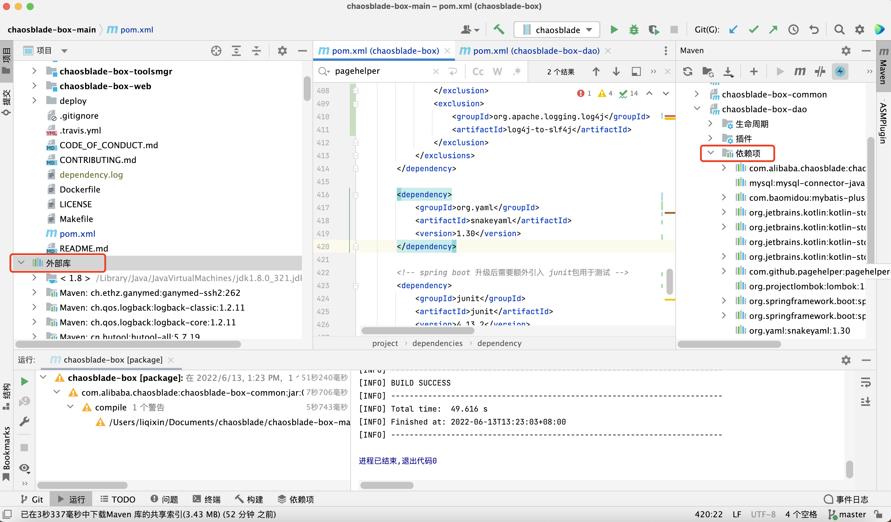

# 依赖方式说明

maven工程总体上分为3种依赖方式：

1，parent依赖方式

2，dependencyManagement

3，dependencies

三种依赖方式的说明如下：

1，父类pom中如果使用了parent内容，那么子module继承自parent后，会自动继承父类pom中的parent部分。

```
    //父类pom中使用，那么子类module就会自动引入spring内容
    <parent>
        <groupId>org.springframework.boot</groupId>
        <artifactId>spring-boot-starter-parent</artifactId>
        <version>2.5.13</version>
    </parent>
```

 2，如果使用的是dependencyManagement方式，父类pom只是进行了声明，子类module中如果想使用，需要在自己的pom中添加引用，version和scope继承自父pom，无需再次填写。

​		另外一点是，如果父pom中引入的组件a使用了exclusions排除了一些组件，这种行为会影响到子项目中引入组件a。

3，对于dependencies来说，父pom中引入后，子项目自动引入。

# 依赖关系分析

maven引入的项目分为两个标识，分别表示groupId，artifactId。

搜索maven项目的版本号需要去maven仓库搜索。

搜索地址是：

https://search.maven.org/

搜索规则是（以spring为例）：

g:org.springframework a:spring，g代表groupId，a代表artifactId。

想要查看一个项目的所有依赖关系使用如下方式

```
//进入项目路径
cd /Users/liqixin/Documents/chaosblade/chaosblade-box-main
//使得java命令生效
source /etc/profile
//查看所有依赖关系，输出至文件中
mvn dependency:tree -Dverbose >> dependency.log
//如果想具体查看某个组件的问题，以冒号作为分割，前面是groupId，后面是artifactId
mvn dependency:tree -Dverbose -Dincludes=junit:junit
```

从idea去看依赖包内容也是分析的重要一环。左侧的外部库是整个工程依赖的jar包。右侧的依赖项可以看到具体一个module的依赖项内容。



# 待完善部分

idea使用maven helper，以及maven dependency helper插件也可以协助进行maven依赖关系分析。正版的idea也可以直接进行依赖包的图示例分析。


