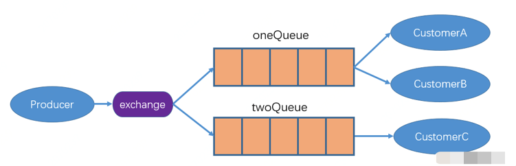

# 基本概念

生产者 ---》1个交换机 ----〉多个队列 ----》多个消费者

具体来说 producer 的一个connection对应多个channel （发消息的通道）至一个mq 。

消费者一个connection多个channel从mq消费。

每个用户在自己的vhost创建exchange和queue。虚拟的分组，namespace等。

binding 交换机和队列的连线。

官网：

rabbitmq.com是官网。下载安装等等。


# 使用

创建channel前的操作都是通用的

```
ConnectionFactory factory = new ConnectionFactory();
factory.setHost(ip)
factory.setUsername(user)
factory.setPassword(passwd)
Connection connection = factory.newConnection();
Channel channel = connection.createChannel();
```

Channel可以创建队列

```
//1,topic
//2,true是持久化 否则内存
//3,false只能是一个消费者消费消息
//4,false消费者断开不删除队列
//5,参数
channel.queueDeclare("test",true,false,false,null);
```

生产者代码

```
String msg = "test"//topic
//1,exchange
//2,topic
//3,其它参数
//4,消息体
channel.basicPublish("",msg,null,message.getBytes())
```

消费者代码

```
String msg = "test"
//1,topic
//2,true是自动应答ack，否则需要手动应答。
//3,正常消费会调用的函数
//4,发生异常会调用的函数（没有验证）
channel.basicConsume(msg,false,deliverCallBack,cancelCallBack)

//另一种标准写法
https://blog.csdn.net/liuhenghui5201/article/details/107192978
```

deliverCallBack

```
DeliverCallBack deliverCallBack = (consumerTag,message) => {
		//得到消息
		new String(message.getBody())
		//得到消息序号
		message.getEnvelope().getDeliveryTag()
		//ack收到该消息，true表示这个消息和之前的消息都收到了，不建议。最好是false。
		channel.basicAck(message.getEnvelope().getDeliveryTag(),true)
		//1,序号
		//2,true 之前的都未确认 都处理失败 , false 只有该序号失败
		//3,true重回队列 false丢弃
		//这里如果处理消息回到队列，队列中看到的是nack消息。一旦消费者程序关闭，nack消息会变成ready消息。
		channel.basicNack(message.getEnvelope().getDeliveryTag(),false,true)
		
}
```


# rabbitmq模式介绍

## 简单模式

单纯使用queue，不使用其它任何内容。


## 工作模式

工作模式的目的是为了防止队列中消息太多，比如当消费速度小于生产速度的时候。一条消息只能被一个消费者消费。一般来说是轮询着来的。


## 发布订阅模式

发布订阅模式解决的是一个消息需要转发给多人的这种情况。 在这种模式下，exchange的type是fanout。

生产者发送消息时，不需要指定队列名字，exchange收到消息后会将收到的消息转发到绑定的队列中（都转发）。

在图中，消息只能被a+c 或者 b+c同时消费。 对于一个queue的消费者来说，还是只有一个人能够消费。




## 路由模式

路由模式下，exchange的type为direct方式。

在rabbitmq的操作界面中，exchange和queue是通过routingkey进行绑定的。

发送者需要指定exchange和routingkey的内容然后发送消息。

消费者需要指定queue的topic内容以及exchange，routingkey的内容。

```
//注解写法
https://juejin.cn/post/6952757780700725256#heading-17
```


## topic模式

routingkey是通配符样式。exchange的type为topic。


匹配规则。发送者发送的是具体的一个key值。exchange根据规则匹配到指定的队列中。

参考链接：

```
https://blog.csdn.net/weixin_42947972/article/details/115218062
```

