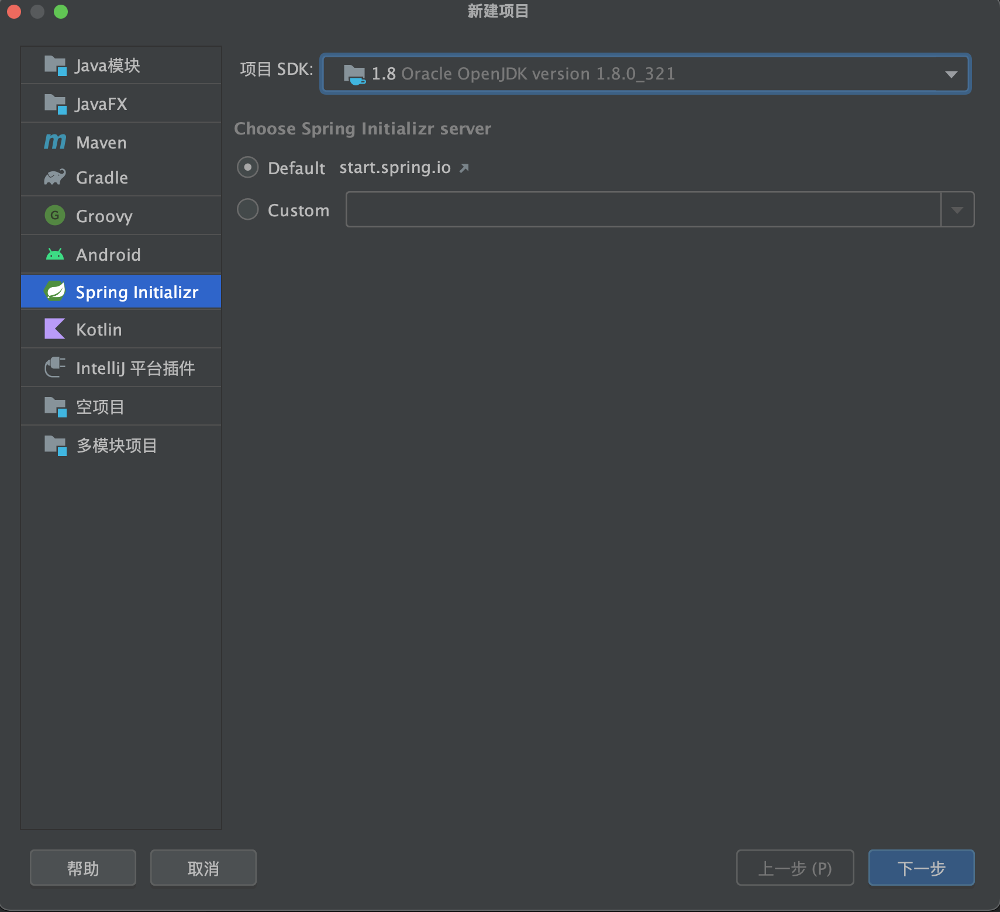
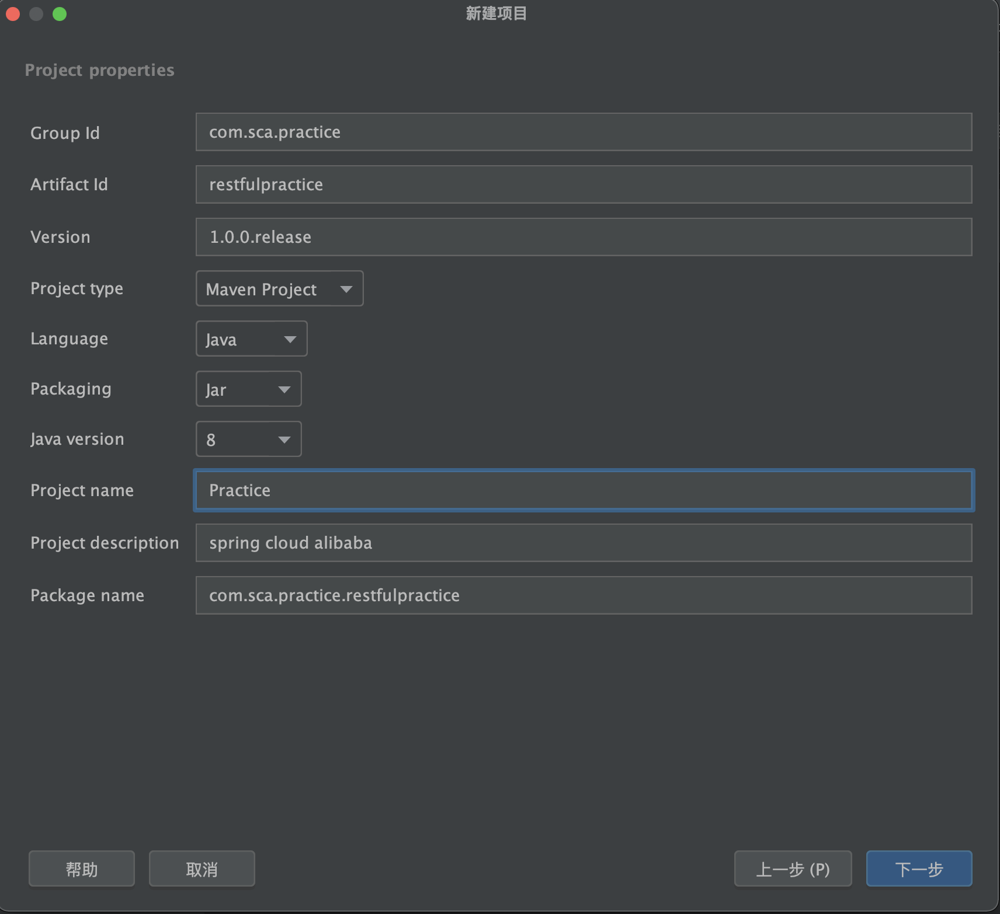
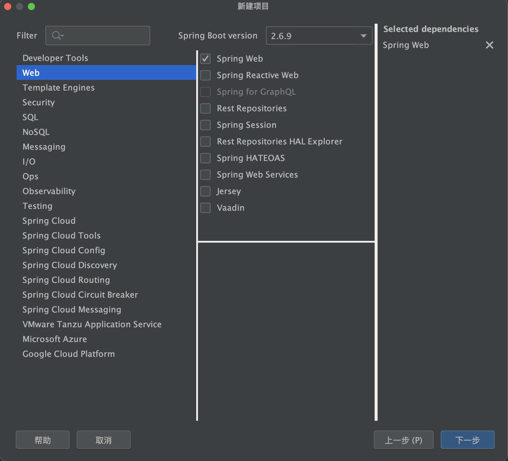

Nacos 从github下载1.3.1版本。

```
cd /Users/liqixin/Documents/alibaba/nacos/bin
//启动
source /etc/profile
sh startup.sh -m standalone //单机
//启动日志位置 start.out
/Users/liqixin/Documents/alibaba/nacos/logs
//访问地址
http://127.0.0.1:8848/nacos/#/login
//默认用户名和密码
nacos:nacos
```

新建命名空间

```
spring cloud alibaba practice
```

使用idea的spring initialzr新建工程



新建项目



选择spring boot。

