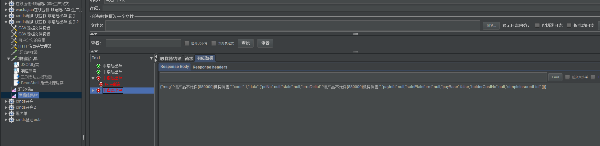
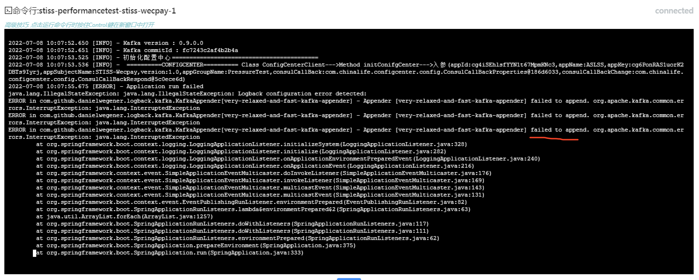

# eshop

门店产品库添加机构


# ipms

ipms添加内容



机构表


# kafka日志推送


报错如下：



排查原因，利用jar命令的覆盖文件，去排查问题，对于appender failed to append 且报 InterruptedException 问题，要第一时间怀疑kakfa server宕机或地址填错、不通等。

修改e门店的两文件解决问题。修改kafka地址为测试环境地址。

```
jar uf Wecpay.jar BOOT_INF/classes/logback-spring.xml
jar uf Wecpay.jar BOOT_INF/classes/bootstrap-PressureTest.yml
```


问题链接：Application not starting when Kafka Servers down 

https://github.com/danielwegener/logback-kafka-appender/issues/53

