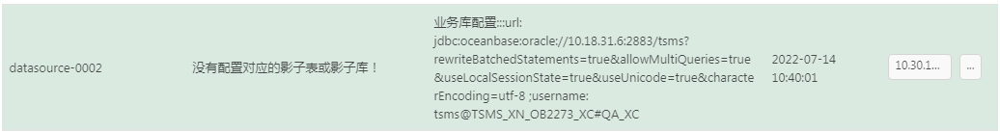
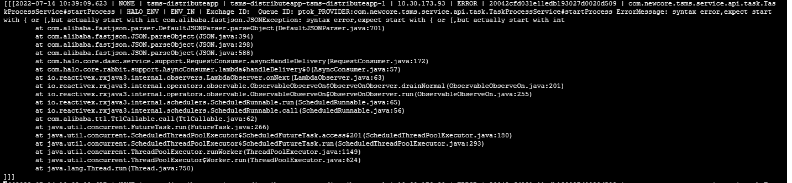
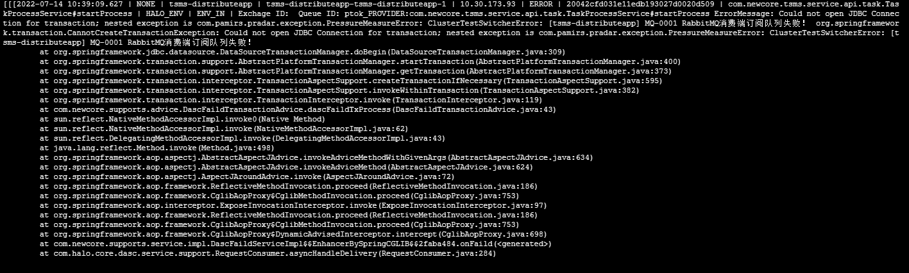

0714:

性能环境现象，tsms连接影子库失败。

这一点很可能的错误原因在于，实际走的业务数据库并不是takin上配置的数据库。这样当正式流量进来的时候，根据正式流量的数据库url去找影子数据库配置的时候，就找不到了。

这里跟猜测的差不多，当tsms切换到信创的时候，数据库连接变成了信创数据库，而这个没有在takin中被配置。

性能环境rabbitmq消息订阅失败错误日志：

已知：

1，

如果在ptok的topic下publish一条消息（随便pub一条），那么就会断开连接（这个是探针的行为）。然后消费者就无法连接到ptok了。

在这个时候，发出影子流量，是否会重新建立连接？（实际测试不会，反而会积压）。

下面这个图是推送错误消息后，tsms的日志。

紧跟着的日志，从mq断开。

2，

1）

即便连接错误的影子库，重启后，如果有影子流量过来，会建立消费者连接。 此时消费者会进行消费一条消息，消息变成unacked。因为连接了错误的影子库，因此在消费该消息后报错没有及时响应ack？

那么继续发很多条，是否是很多条unacked呢？

等了一段时间后，再发了几条，consumer掉线。

补充知识：

在什么情况下，消息会变成unacked。1）回复nack，但是又扔回队列。

探针知识：

当影子流量来之后，遇到了白名单错误或者影子库错误，则调用pradarclose方法 ，1分钟的探针压测开关。

在这一分钟之内，如果又来了影子流量，就会发生error导致断开。错误关键字：ClusterTestSwitcherError（在探针日志中出现）。

2）

长时间连接错误影子库，consumer会不会自己掉线。

3，

如果连接正确的影子库，没有影子流量过来，ptok的topic是否会有消费者连接上来。

# tsms

tsms所消费的queue是可以删除的，删除之后，重启app才能重建。但是queue相当于是可以程序进行

重建的。