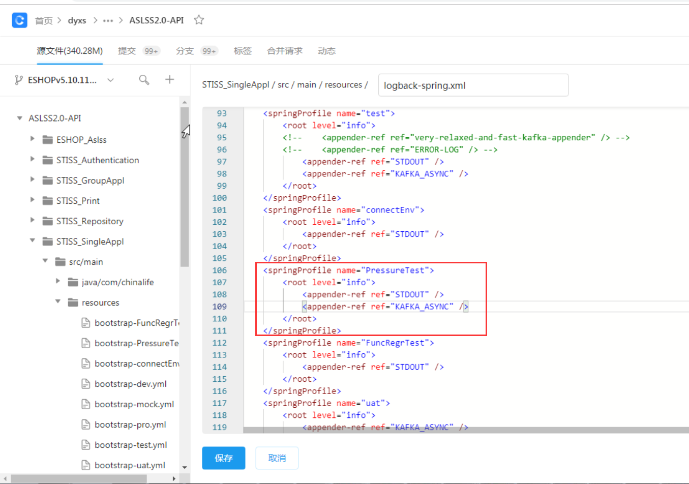
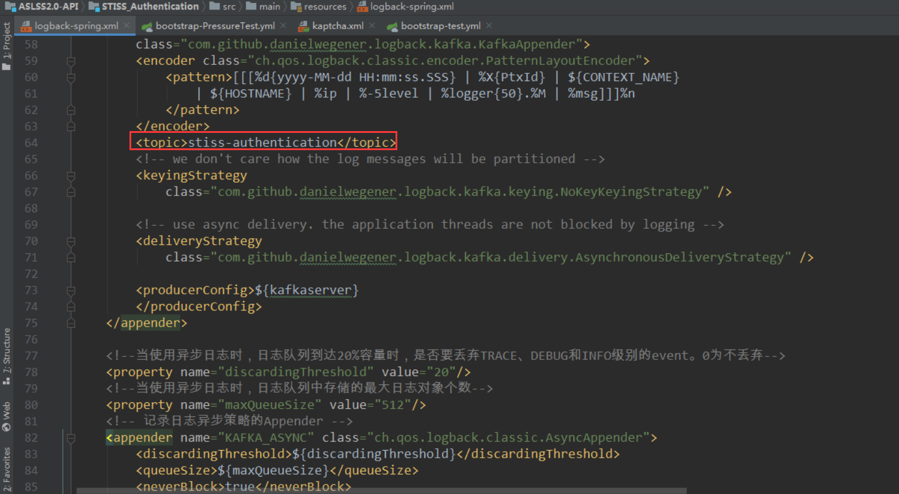
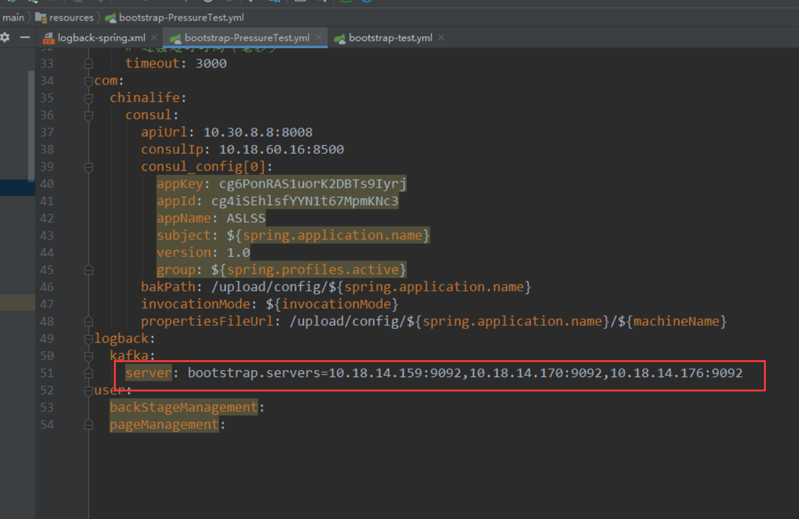
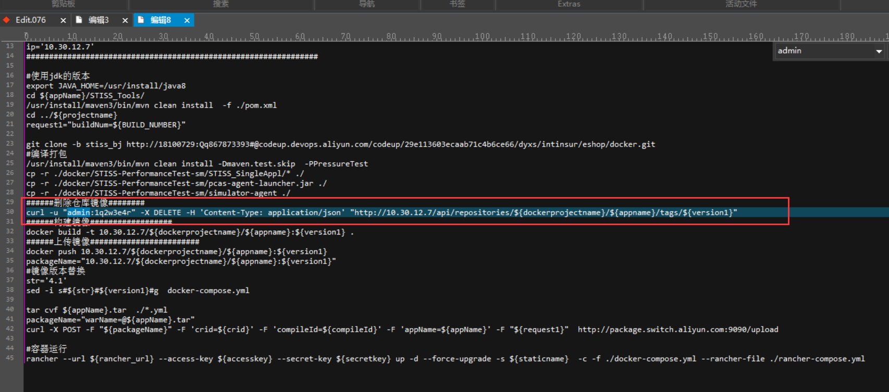
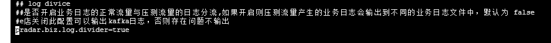
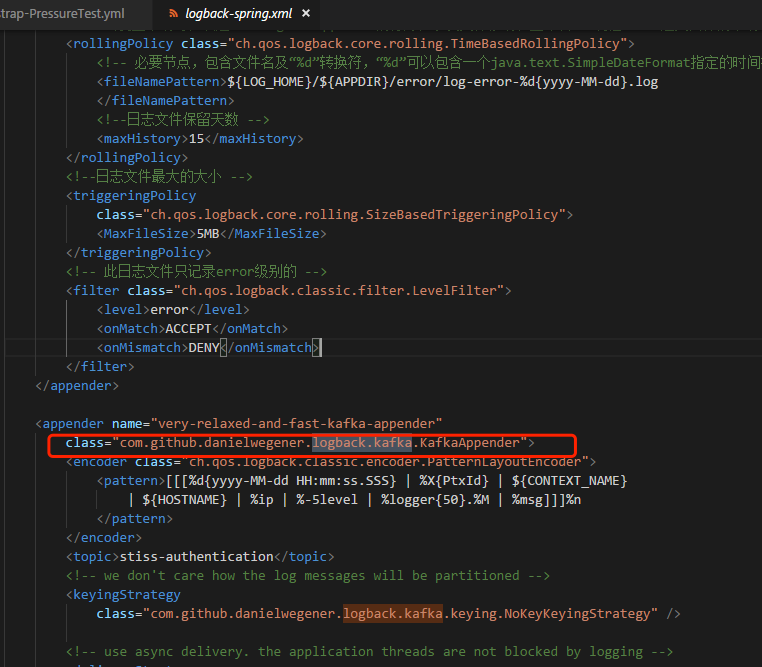
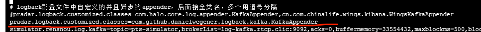
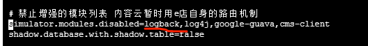

1，问题记录1

e门店服务启动的时候，会告诉网格自己是蓝节点和绿节点。e门店走网格调别的服务，e门店自己打什么标签，就会往后带。但是这样就会调orbps，uwbps。调同标签的服务。 所以e门店会调网关，还是调localhost:19001。这是一种很危险的行为。

契约8个灰度，16个生产，但是这次只压到灰度的8个。


从sidecar发出请求，会在header头带上标签。到下游的服务，就自动去找对应标签的服务。e门店目前用灰，sidecar标注了灰的头，会跑到orbps的灰的服务去了。e门店不能去标签。系统和系统之间能不能不加env的头。


2，问题记录2

e门店报异常实际上是之前链路的报错，但是长时间异常会导致服务的异常。


3, 标签记录

这个E门店green环境对应的就是gray标签，blue环境对应的是prod标签。


# e门店kafka日志输出配置

logback打开kafka推送功能。



topic设置位置。



kafka地址位置。



e门店构建镜像脚本。




# e门店日志输出至kafka调试

在探针节点自己的配置下

```
cd /opt/simulator-agent/agent/simulator/config
vi simulator.properties
```

需要关注以下三处：



这里是根据e门店的配置文件来定的。



根据配置中的内容决定了下面的填写。



如果加上了第二处内容，就要去掉第三处内容。




判断是否有kafka内容输出，在tmp下找探针日志。

```
tail -f trace日志 ｜ grep kafka //当e门店开启kafka日志推送功能时，这里应该有输出
```


# e门店openresty

openrestry 里面配置了 header  env:eshopxn。

比如发往核保，核保的网格网关配置中，需要将其配置到 env:xn上。 有一个default，当前面的服务不通时，走default。