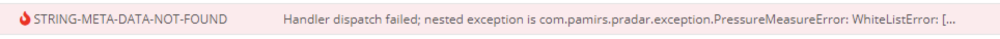

# jmeter调试

jmeter需要将版本换为apache-jmeter-5.1.1

需要在出单页面设置好csv路径。

第一个是投保人的csv，第二个是被保人的csv文件。


脚本请求地址是

```
http://10.18.30.77:9002/STISS_SingleAppl/SingleAppl/insureApplCommit
```

因此，排查问题时，需要关注e门店的eshop-singleappl-prsm的日志。


# 链路调试问题

## 容器记录

e门店容器之前涉及（生产查询）：

eshop-singleappl

eshop-repository

eshop-verification (销售规则，有的产品用， 有的产品不用)

eshop-wecpay

eshop-aut


## 白名单记录

### eshop-singleappl

链路调试中最主要的问题在于白名单问题，需要在对应的入口app顺藤摸瓜查看为什么请求是失败的。比如下图的示例是一个典型的白名单错误。



一般我们需要记录白名单的发起方和请求地址。由于地址在内网，因此白名单列表放在E:\2022新工作\e门店压测下。

白名单发起方：

eshop-singleappl-perform

白名单请求地址：

http://10.30.110.1:8090/cmds/cmdsinterface/QueryRepetitionBatchFlag


## 问题记录

### 1，e门店 singleapp  T_BS_CONT_BAK 缺少ip字段导致报错。

和开发环境数据库进行对比后，补充脚本解决。T_BS_CONT_BAK  契约出单报错会使用这个表，因此本质上还是使用了压测标导致报错后从而导致的错误。 业务流量正常，是因为业务流量没有报错，没有使用这张表。


### 2，e门店多出来的redis的key会影响启动。

HttpTraceLogContentType，删除key即可恢复e门店的服务启动。  为什么会多出来这个key，其原因可能是性能数据库存在错误的信息，点击redis同步之后，数据由数据库同步至redis中，而e门店的拦截器在处理请求时，会访问到该redis的key值，由于该key的value存在语法错误，导致e门店singleapp的启动失败。从而导致海东青的日志非常少。 已经记录在doc.qq中的问题记录单中。


### 3，契约白名单问题。

契约报错，可以从压测平台直接去设置白名单，查看异常信息。


### 4,  契约影子库问题

需要看契约日志，契约的压测日志在以下路径下,但是像e门店日志就还是自己的。契约的压测日志单独放在一个路径下。

```
/tmp/pradarlogs/orbps-psnserviceapp/logs/orbps/psnserviceapp
```

契约白名单问题通过压测平台检查。 性能契约服务在stress05下。


### 5，有一些异常的白名单

这部分实际上是只有出单报错才会调用的逻辑，因此不需要实际加入白名单。


### 6，redis黑名单。

redis黑名单未必会实际生效，可能导致依旧访问影子的redis的key，因此需要去平台数据库确认实际内容。


### 7，节点下线

海东青节点下线，探针日志也报get平台fail的错误。只要上报到平台下线，后面就很难再连上了，除非重启。重启后恢复。


### 8,   契约psn依靠mongodb。

报错日志如下：


可以看到机器在181上。重启方法在wiki上有记录。位置在e门店的链路调试记录中。业务正常，影子流量超时一般是这个问题。

```
cd /secms/mongodb-linux-x86_64-3.6.14/bin/
nohup ./mongod -f orbps_pt.conf &
```


### 9，契约生产环境数据库超时且无法访问

用户名大小写未区分。