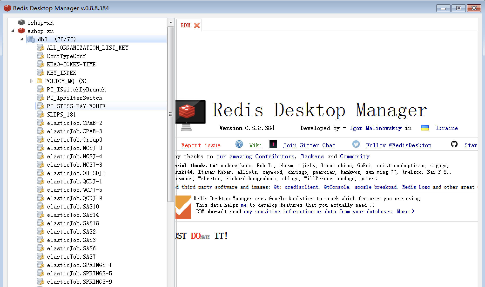
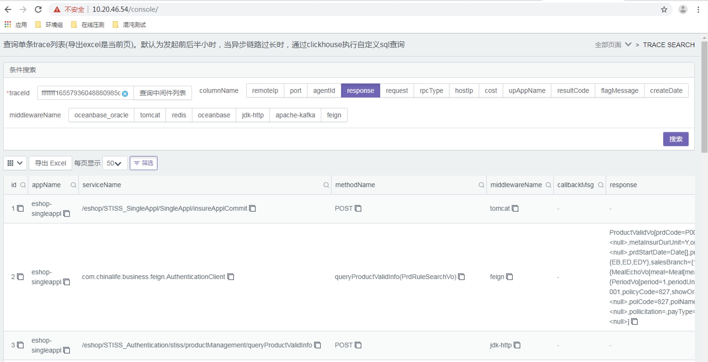

# 探针安装

## 地址参考

探针安装参考地址：

```
http://10.18.28.181/zh/探针/simulator-agent安装手册
```

测试环境在线压测平台，查看探针是否安装成功。

```
http://10.30.16.102:30080
```

工具平台

```
http://10.30.16.102:30080/console/
```

右上角可以选择各种功能。


旧版链路调试：

```
http://10.18.20.68:18086
```


## 生产环境

在线压测生产平台的登录地址为：

10.20.46.54/tro/#/login

需要使用admin账号进行登录，具体密码查看腾讯云文档的《机器密码资源》。


## 测试环境探针安装

wget不好用时，使用curl

```
cd /opt/
rm -rf simulator-agent
curl -O 10.18.20.60/artifactory/OPMS-Generic-Release-Local/commoon/simulator-agent-release.tar
tar -xf simulator-agent-release.tar
```


## 压测日志

以契约为例，压测探针日志在以下路径。一般来说，我们去看simulator-agent.log 以及 simulator.log 。错误日志查看simulator-agent-error.log.数字，但是一般看不出什么。

```
/tmp/pradarlogs/orbps-psnserviceapp/logs/orbps/psnserviceapp
```


# 压测平台使用

## 新增白名单

在压测平台10.30.16.102:30080/tro/#/appManage下搜索系统名称，进入应用管理页面。


应用状态下可以查看一些白名单配置


点击远程调用编辑即可。


实际上对于对端应用带不带探针，只要访问外部接口，都需要设置白名单允许请求通过。设置白名单时，需要询问开发，是否涉及读写。如果对端应用安装过探针，不会有危险异常的错误。


## redis黑名单使用

Redis 的key加入黑名单，使得应用访问正式的redis。


redis的key值设置黑名单可能不管用，需要修改压测平台数据库的内容，全局设置。

影子redis的原理是在key之前加入ptok_前缀。一旦redis没有影子key，就会报错，暂时可以设置黑名单，让服务访问正式的redis的key。

使用redis desktop manager可以连接eshop的性能redis查看内容。软件放在了2022新工作的redis管理路径下。




## mock原理

mock有两种方式，一种是函数返回的mock。另一种是mock server，需要开墙。


# 链路调试平台


## 旧版链路调试

左侧输入traceid后可以进行链路查看。


## 查看应用涉及了哪些中间件

以下是查看e门店访问redis。

数据库需要勾选oceanbase，mongodb的内容。


## 通过traceId排查全部接口

通过jmeter请求中，header携带traceid的方式，排查所有的外部调用接口。

traceid在jemeter下的配置方法是

```
ffffffff$(__time(,))0${__Random(100,999,)}d0030
```


可以先将p-pradar-cluster-test置为非true。之后使用业务流量进行全部接口的查看。和压测平台的白名单做对比。


通过traceid来判断卡在哪里了，同时可以勾选response看响应结果。海东青没有结果的时候，就可以靠这里看。白名单错误也是在response结果中出现的。




## 脚本调试

可以在在线压测平台执行脚本进行调试。一般是性能组添加。


也可以通过jmeter引擎直接进行压测。走正式脚本。


调试请求条数为1，并发数为1。


# 排查方式

## 海东青日志排查

海东青可以根据请求的traceid，在header中进行查找，判断是否是自己测试的这条数据。


## 海东青具体信息节点

可以通过inspect按钮，查看到具体节点和ip，和在线压测平台的ip进行比对。


## 全球鹰使用

全球鹰生产地址

10.20.51.23:5601 //一般在线压测

10.20.51.22:5601 //这上面搜不到数据

选择discover。

filter找一个kafka-orbps-personalapp

搜索投保单号1191A22008354344或error等信息进行查询。

