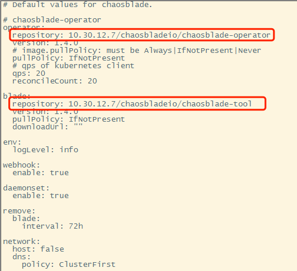
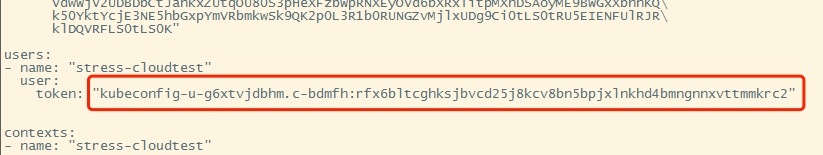
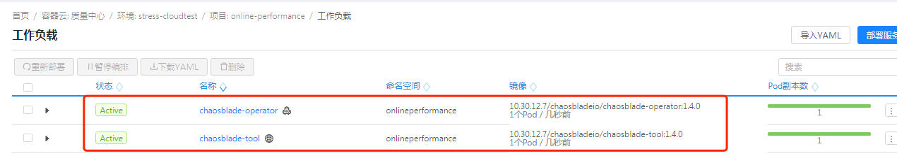

首先需要从github上下载helm工具。

这里使用文件如下

```
helm-v3.8.2-linux-amd64.tar
tar xf helm-v3.8.2-linux-amd64.tar
cd linux-amd64
cp helm /usr/local/bin/
helm version //3.8.2

//下载kubectl
curl -LO "https://dl.k8s.io/release/$(curl -L -s https://dl.k8s.io/release/stable.txt)/bin/linux/amd64/kubectl"
cp kubectl /usr/local/bin
chmod 777 /usr/local/bin/kubectl
kubectl version
```

配置权限

```
配置在
/root/.kube/config 文件下
配置好后输入
get pod -n onlineperformance 即可获得信息
```

# chaosblade-operator

https://github.com/chaosblade-io/chaosblade-operator

从这里下载内容

```
chaosblade-operator-1.4.0-v3.tgz
```

修改里面的values.yaml，替换两个仓库地址。

原先的镜像地址在dockerhub中。

https://hub.docker.com/search?q=chaosbladeio



安装命令

```
helm install chaosblade-operator chaosblade-operator-1.4.0-v3.tgz -n onlineperformance
```

权限问题：

/root/.kube/config 下 users的token实际决定了权限。



权限问题解决后，敲入上述的安装命令就可以安装以下两个工具了。（镜像实际上已经由外网迁移至内网harbor中）



同时box的页面中也需要修改一下用户权限。

通过这样的操作方式，可以让box发现所有的pod节点，从而进行故障实验。（paas权限找王希敏开通。）

卸载和查询操作：

```
helm uninstall chaosblade-operator -n onlineperformance
helm list -n onlineperformance
```

