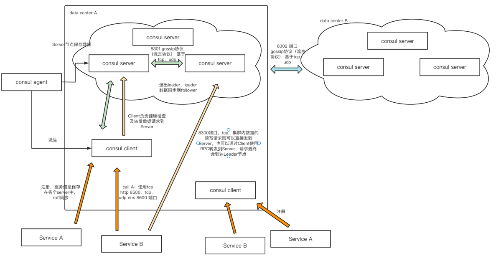
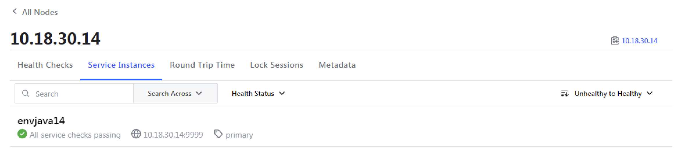

# 基本安装

首先需要在centos7上安装consul。

```
docker run -d -it -p 19022:22 -p 19001:8500 --name centos1 centos-lqx:1.0.0
//参考https://www.consul.io/downloads
yum install -y yum-utils
yum-config-manager --add-repo https://rpm.releases.hashicorp.com/RHEL/hashicorp.repo
yum --downloadonly --downloaddir=/root/yumsrc install consul
```

出现4个包。

```
consul-1.12.2-1.x86_64.rpm   openssl-1.0.2k-25.el7_9.x86_64.rpm
make-3.82-24.el7.x86_64.rpm  openssl-libs-1.0.2k-25.el7_9.x86_64.rpm

//如果出现冲突怎么办？
rpm -e --nodeps openssl-libs-1.0.2k-25.el7_9.x86_64.rpm
rpm -ivh * 

//依赖在哪里找
https://pkgs.org/

//如何强行安装 最好的办法还是按顺序进行安装
rpm -ivh * --nodeps --force
```

启动方式

启动命令解析：

agent表示启动Agent进程。server表示启动Consul Server。client表示启动Consul Client。bootstrap表示这个节点是Server-Leader。集群的第一次启动需要带，后面不需要。ui表示启动web ui管理器。node表示集群中唯一的节点名称。client表示consul的服务侦听地址，对外服务改为0.0.0.0。

```
consule agent --help
//data_dir
mkdir /root/consul
consul agent -server -bootstrap -ui -node=consul1 -client='0.0.0.0' -data-dir=/root/consul
//进程302 查看consul开放的端口 netstat -ntlp      
tcp6       0      0 :::8301                 :::*                    LISTEN      302/qemu-x86_64     
tcp6       0      0 :::8302                 :::*                    LISTEN      302/qemu-x86_64     
tcp6       0      0 :::8500                 :::*                    LISTEN      302/qemu-x86_64          
tcp6       0      0 :::8600                 :::*                    LISTEN      302/qemu-x86_64     
tcp6       0      0 :::8300                 :::*                    LISTEN      302/qemu-x86_64 
```

简单理解的话，开放端口如下，8301和8302是server之间的通信端口。8500和8600我的理解是Service端调用consul需要的内容。8300是consul client向consul server发出请求时访问的端口。



从docker容器中拷贝出安装包：

```
//得出id
docker ps
//容器向本机传输
docker cp e63ecb877f68:/root/yumsrc/openssl-libs-1.0.2k-25.el7_9.x86_64.rpm /Users/liqixin/lqx
docker cp e63ecb877f68:/root/yumsrc/openssl-1.0.2k-25.el7_9.x86_64.rpm /Users/liqixin/lqx
docker cp e63ecb877f68:/root/yumsrc/make-3.82-24.el7.x86_64.rpm /Users/liqixin/lqx
docker cp e63ecb877f68:/root/yumsrc/consul-1.12.2-1.x86_64.rpm /Users/liqixin/lqx
//内网如果具备了openssl以及make，直接安装consul即可。
rpm -ivh xxx
//consul安装位置
/opt/consul 或 /usr/bin/consul
```

内网启动

```
//10.18.30.45
nohup consul agent -server -bootstrap -ui -node=10.18.30.45 -client='0.0.0.0' -data-dir=/root/consul &
//其余server怎么启动 10.18.30.32
nohup consul agent -server -node=10.18.30.32 -client='0.0.0.0' -data-dir=/root/consul -join=10.18.30.45 &
//10.18.30.79
nohup consul agent -server -node=10.18.30.79 -client='0.0.0.0' -data-dir=/root/consul -join=10.18.30.45 &

//如何启动一个consul client？
nohup consul agent -server=false -node=10.18.30.14 -client='0.0.0.0' -data-dir=/root/consul -join=10.18.30.45 -config-dir='/etc/consul.d' &
```

Consul client 开放的端口只有3个，8301，8500，8600。


## 参考内容

consul中文介绍

https://cloud.tencent.com/developer/article/1368802

consul英文学习网站

https://learn.hashicorp.com/consul


# 注册服务

配置文件位置

```
//-config-dir指定目录
/etc/consul.d

//其下两个配置文件
consul.env
consul.hcl

//之后在指定目录下创建json文件 任意名字应该都可以

//services.json
{
  "services": [
    {
      "id": "envjava14", //唯一id
      "name": "envjava", //服务名称，可以重复
      "tags": [
        "primary" //标签
      ],
      "address": "10.18.30.14", //服务地址
      "port": 9999, //服务端口
      "checks": [
        {
        "http": "http://10.18.30.14:9999/basicInfo/serviceInfos?serviceSortName=pcms", //探活地址
        "tls_skip_verify": false,
        "method": "Get", //探活请求方式
        "interval": "10s", //间隔10秒一次
        "timeout": "1s" //如果接口1s后返回则不行，返回200则为正常
        }
      ]
    }
  ]
}

//之后在本机启动服务开启端口即可
```

node下新增service instances。



·