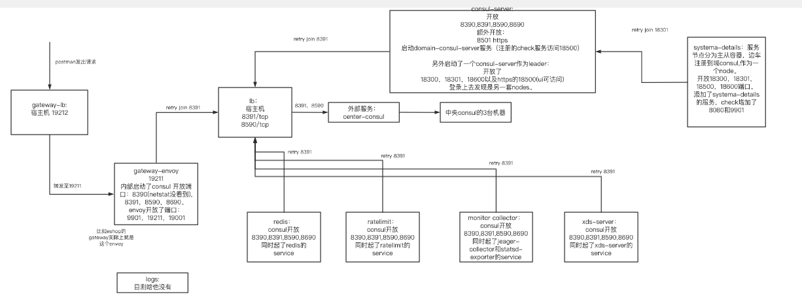

# 网格团队搭建信息

内网中央consul主要部署在三台机器上：

10.18.27.177,10.18.27.189,10.18.27.196

启动命令

```
//原始命令
cd /datafs/servicemesh/consul/log/
nohup /usr/local/bin/consul agent -config-dir=/datafs/servicemesh/consul/config/ 2>&1 &
//带上ui 其实没必要带，因为配置文件中已经带了。
nohup /usr/local/bin/consul agent -ui -config-dir=/datafs/servicemesh/consul/config/ 2>&1 &
```

访问web的端口改为8590。10.18.27.196:8590。

访问web需要输入acl串，该串在config的tokens中，输入后才可以看到node，service等信息。

查看consul状态

```
consul operator raft list-peers -http-addr=http://127.0.0.1:8590 -token=acl字符串
```

内网的中央consul对于端口进行了修改。

默认的话，

简单理解的话，开放端口如下，8301和8302是server之间的通信端口。8500和8600我的理解是Service端调用consul需要的内容。8300是consul client向consul server发出请求时访问的端口。

内网中，对于8302是屏蔽了的，因为consul和consul跨域沟通是没有的。self_wan。

8301 变为 8391。consul server相互交互内容。self_lan。

8300 变为 8390。consul client向consul server发出请求。 envoy集成了consul client。 server。

8500变为8590，http。

8600变为8690，dns。

默认的话，consul client开放端口：

Consul client 开放的端口只有3个，8301，8500，8600。 少了consul server处理consul client端口，其余一样。


内网部署图：



# 混沌实验

如果停止3台中央consul，对于注册在域consul的demo服务来说，还是可以通过gateway去访问到。这是因为一旦服务注册成功，gateway实际上就知道了demo服务的地址。

只有服务地址变化了，升级导致ip变化等等，才会用到中央consul。

域consul的web界面可以通过宿主机的18500来看到。