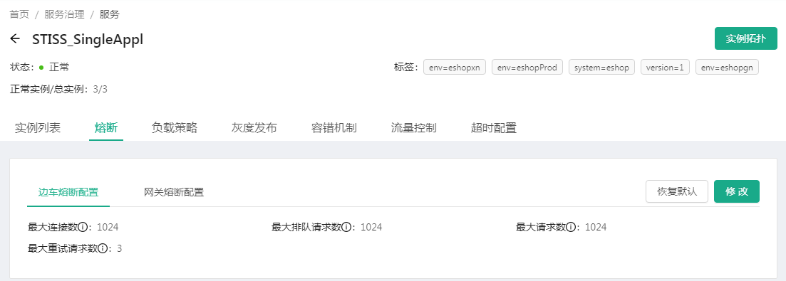

# 熔断

参考对接网格注意事项，熔断配置包括边车熔断配置和网关熔断配置。

这里的熔断设置主要是限制微服务的最大连接数，防止网格gateway连接数被占满。

同时，网格gateway的最大连接数也是可以配置的，这个权限没有，暂时看不到。

请求数和连接数的区别：

客户端发起建立连接的请求的数量。发起请求未必可以成功建立连接。另一方面一个连接上可以有多个请求。

## 失败重试机制

当微服务返回报文的http头包括了5xx类返回码，边车envoy会重新向微服务发出请求。直到返回200。这个解释了最大重试请求数。

# 超时配置

超时时间是90秒。其含义是一个请求最多占用连接的时间。不能太短，防止业务没办法完成。不能太长，防止占用连接时间过长。各个微服务的超时时间指的是envoy调用服务的时间。gateway到envoy的时间依然是90秒。因此超时时间只能设置比90秒要小。

# 限流机制

限流不确定是否是网格提供的功能。从网格来看，流量控制可以针对url进行每秒请求数的限制。

但是限流平台通过令牌数限制请求数。请求超过令牌数，amp会收到告警。amp负责收到告警。通过限流平台可以查看请求数占用令牌数的情况。

寿险平台的策略，当请求响应时间超过1秒，触发熔断。一分钟内熔断次数超过100次，发出告警。

动态调整熔断，就是调整超时时间的策略来减少熔断数，熔断会直接导致前端显示错误。

