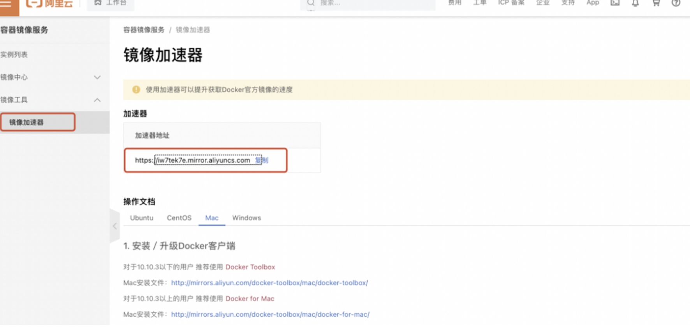

# docker基本使用

首先需要完善镜像的构造。
容器加速链接地址：
https://cr.console.aliyun.com/cn-hangzhou/instances



操作如下：


Dockerfile制作

```
//简单命令
//检查是否安装成功
docker info 
//拉取镜像 但属于amd芯片
docker pull --platform=linux/amd64 centos:7 

cd /Users/liqixin/lqx
vi Dockerfile
//文件内容 制作镜像
FROM --platform=linux/amd64 centos:centos7.9.2009
# COPY ./entrypoint.sh /usr/local/bin/
RUN yum -y install wget  \
        && yum -y install net-tools \
        && yum -y install initscripts \
        && yum -y install openssh-server \
        && /usr/sbin/sshd-keygen -A \
        && yum -y install java-1.8.0-openjdk \
        && mv /etc/yum.repos.d/CentOS-Base.repo /etc/yum.repos.d/CentOS-Base.repo.bakup \
        && wget -O /etc/yum.repos.d/CentOS-Base.repo https://mirrors.aliyun.com/repo/Centos-7.repo \
        && yum makecache \
        && yum -y install lrzsz \
        && yum -y install maven which unzip \
#        && cd /usr/local/bin \
#        && chmod 777 entrypoint.sh \
        && yum clean all \
        && echo "root:Kjy@2018"|chpasswd
        CMD ["/usr/sbin/sshd","-D"]
//制作镜像
docker build -t centos-lqx:1.0.0 .

//运行容器 -d是后台运行的意思，否则输出前台 后面跟镜像id
docker run -d -it -p 19022:22 -p 19080:80 --name centos1 centos-lqx:1.0.0
//重启容器 
docker start containerid
//端口占用查看
lsof -i:19022

//删除重启后，变为1.5G 慎用
/Users/liqixin/Library/Containers/com.docker.docker/Data/vms/0/data
```

docker互传命令

```
docker ps
//容器向本机传输
docker cp 1f69113cd904:/root/xxx /Users/liqxin/xxx
//本机向容器传输
docker cp /Users/liqixin/xxx 1f69113cd904:/root/xxx
```


# docker 内网使用

docker images显示已有的镜像内容和版本。

```
docker pull repository:tag //从远程拉取至本地
ocker build -t 10.30.12.7/chaosblade/chaosblade-agent:1.0.0 .  //代表当前目录
docker push 10.30.12.7/chaosblade/chaosblade-agent:1.0.0
```

dockerfile中的yum如何解决？其实际上执行的是内部的镜像源，需要进行替换。

替换路径一般为：

```
/etc/yum.repo.d/CentOS-Base.repo
```

docker push 需要18100830权限，在harbor中添加。

另外需要注意的是把 entrypoint.sh copy至 /usr/local/bin下后，需要赋予执行权限，否则镜像启动失败。

如果docker制作完启动失败怎么办？

```
docker ps -a
docker logs containerid
docker run -d 镜像名词:版本
//或者
docker run -it 镜像地址:版本 /bin/bash
//进入后启动jar包看能否成功启动
```

entrypoint.sh需要注意编码格式，编码格式有问题会导致启动镜像失败。
